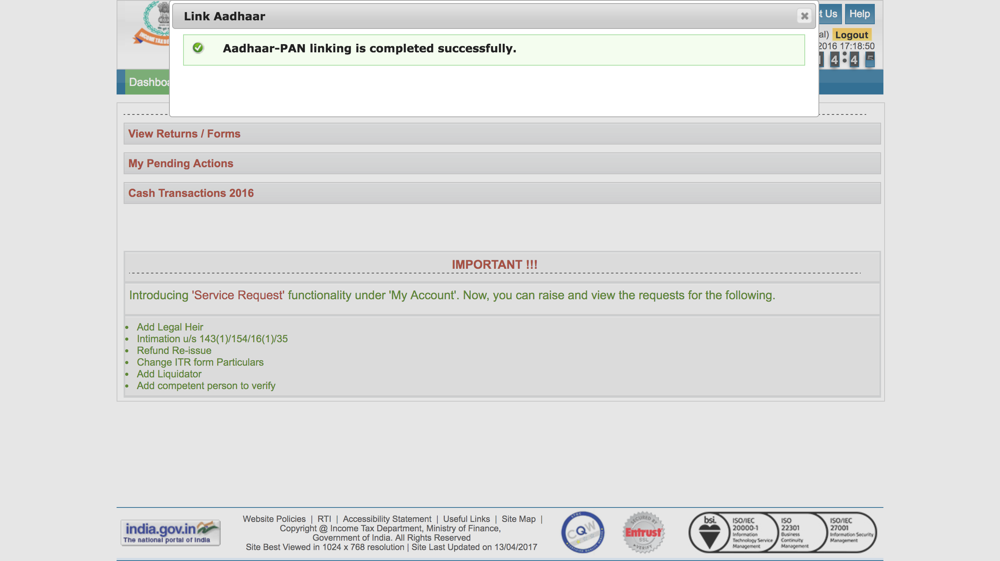

The government of India have announced mandatory linking of Aadhaar and PAN card for its citizens.

Excerpt from press release:

"Mandatory quoting of Aadhaar/Enrolment ID of Aadhaar application form, for filing of return of income and for making an application for allotment of Permanent Account Number with effect from 1st July 2017,"

### Steps to link your cards:
1. [Login](https://incometaxindiaefiling.gov.in/e-Filing/UserLogin/LoginHome.html) into Income Tax e-Filing Portal. If you don't have an account, you can [register here]( https://incometaxindiaefiling.gov.in/e-Filing/Registration/RegistrationHome.html) to create a new account.

2. After login, a popup will appear to link your Aadhaar card. Fill up the form and submit.
In case, if you don't see a popup dialogue. Goto "Profile Setting" -> "Link Aahaar" to submit the form.

3. You should see a success message like the one below.

### Note: Your name in PAN and Aadhaar should match exactly, else you have to update your PAN card to have a full name.
